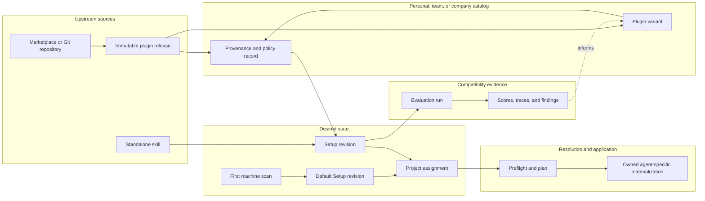

# Agent Harness Manager — Product and Implementation Roadmap

Status: accepted product direction; implementation roadmap

Last updated: 2026-08-30

## 1. Purpose

Agent Harness Manager lets individuals, teams, and companies assemble, evaluate, assign, and safely switch the capabilities used by AI coding agents.

The product is not another plugin format or marketplace. It is the management layer between upstream capability sources and the agent-specific files or configuration installed on a machine or project.

Its core promise is:

> Choose an exact agent setup, understand what it contains, evaluate whether its parts work together, and apply or replace it without losing the previous known-good state.

This document is the source of truth for the product model and implementation sequence. It supersedes earlier exploratory language in `CLI-POC-BRIEF.md` about time-limited trials, automatic promotion, and scheduled rollback. Those are not product requirements.

## 2. Product wedge

The first useful product is deliberately narrow:

1. Scan the user's current agent configuration.
2. Capture it as an editable **Default Setup** with an immutable first revision.
3. Let the user compose another Setup from plugins and standalone skills.
4. Assign either Setup to a project.
5. Resolve the Setup into agent-specific materializations with a safe preview.
6. Let the user manually select Default Setup whenever they want to return.

Once this switching foundation is reliable, the product adds provenance, variants, compatibility analysis, dynamic evaluations, company governance, and interaction graphs.

## 3. Accepted product decisions

### 3.1 No time-based experiment lifecycle

A Setup remains active until a user or an authorized policy changes it. There is no built-in concept of “try for a week,” expiration, automatic promotion, or scheduled rollback.

Returning to a previous state is a manual Setup selection. Transactional rollback after a failed write is an implementation safety mechanism, not a user experiment lifecycle.

### 3.2 Plugins remain the distribution container

Plugins are the industry-facing container for capabilities such as skills, commands, hooks, agents, scripts, MCP servers, and settings. Agent Harness Manager consumes these formats; it does not invent a competing Pack format.

Standalone skills remain supported because many ecosystems and existing installations expose them directly.

### 3.3 A Setup is composition, not packaging

A **Setup** is the desired state selected for a project or user context. It references exact plugin releases, plugin variants, standalone skills, target agents, and configuration. It does not copy or hide those artifacts inside an opaque package.

“Bundle” may be used informally in UI copy or export actions, but it is not a first-class domain object. “Workflow” is reserved for an actual ordered procedure, not a collection of installed capabilities.

### 3.4 Imported releases are immutable

An imported Plugin Release is content-addressed and never edited in place. Any content change creates a Plugin Variant with explicit lineage.

### 3.5 Configuration overrides do not require a variant

Project paths, environment references, target agents, enabled components, feature toggles, and supported per-plugin settings belong in the Setup when the plugin contract permits them.

Changing instructions, skills, scripts, hooks, manifests, or other plugin content creates a Plugin Variant.

### 3.6 Applying a Setup is adapter-specific

A logical project has one active Setup assignment. Its physical representation may require symlinks, junctions, copies, configuration merges, or native agent installation. It cannot be assumed to be a single symlink.

Every generated materialization must have an ownership record so the manager only replaces or removes files it owns.

## 4. Domain model

| Concept | Meaning | Mutability |
| --- | --- | --- |
| Plugin Release | An exact imported upstream plugin identified by source, version/ref, commit when available, and content digest. | Immutable |
| Plugin Variant | A derived plugin with an explicit base, patch or diff, resolved snapshot, owner, reason, and new digest. | Drafts are editable; published revisions are immutable |
| Standalone Skill | A skill consumed without a plugin container for ecosystem compatibility. | Imported versions are immutable |
| Setup | A named composition the user edits over time. | Mutable pointer to revisions |
| Setup Revision | An exact resolved selection of releases, variants, skills, targets, and configuration. | Immutable |
| Default Setup | The user-visible Setup created during onboarding from the detected machine state. | Editable through new revisions |
| Project Assignment | The active Setup Revision selected for a project. | Mutable pointer |
| Materialization | Agent-specific files, links, copies, merges, or native registrations produced from an assignment. | Replaceable, with ownership records |
| Evaluation Run | Static or dynamic evidence generated against an exact Setup Revision and harness configuration. | Immutable result |
| Catalog Entry | Discoverability, provenance, approval, compatibility, and policy metadata for a release or variant. | Versioned metadata |
| Workflow | An ordered procedure composed from capabilities. | Versioned independently when introduced |

### 4.1 Identity and lineage

Human-readable versions aid discovery, but content digests provide identity. A reproducible reference includes both provenance and resolved content:

```text
source + upstream ref/version + commit (when available) + content digest
```

A Plugin Variant additionally records:

```text
base release or variant + patch/diff + resolved snapshot digest + owner + reason
```

A Setup Revision records exact artifact identities rather than floating marketplace labels. Secrets and machine-specific credentials are referenced, never embedded in a revision.

## 5. System relationship



Important distinctions:

- The catalog knows what an artifact is and whether it may be used.
- A Setup Revision says exactly what should be active.
- An assignment says where that Setup Revision is active.
- A materialization records what was actually written for each agent.
- An Evaluation Run is evidence about a revision, not a mutation of it.

## 6. Core invariants

1. Imported releases and published variants are never mutated.
2. Every active assignment resolves to one immutable Setup Revision.
3. A materialization records its Setup Revision, target adapter, strategy, paths, and ownership.
4. The manager never deletes or overwrites unmanaged user content without an explicit adoption decision.
5. A failed apply restores the pre-apply managed state or reports a recoverable partial state.
6. A Setup change creates a new revision; existing Evaluation Runs continue to point to the old revision.
7. AI-generated modifications are proposals until a user or authorized policy accepts them.
8. Upstream updates are explicit and never silently alter a variant or active Setup Revision.
9. The first detected machine state remains recoverable even if Default Setup is later edited.
10. Static analysis, dynamic evaluation, and trust policy remain distinct forms of evidence.

## 7. Primary user flows

### 7.1 First-run scan and Default Setup

1. Scan supported agent locations and native configuration.
2. Classify detected entries as known artifacts, unresolved local content, or conflicts.
3. Show a review screen before adopting anything.
4. Snapshot the accepted state as the first immutable Default Setup Revision.
5. Record which existing paths are adopted as managed and which remain external.
6. Assign Default Setup to the selected scope only after confirmation.

The first snapshot is always retained. Editing Default Setup creates another revision; it does not rewrite the onboarding snapshot.

### 7.2 Create and assign a Setup

1. Create an empty Setup or clone an existing revision.
2. Add exact Plugin Releases, Plugin Variants, or standalone skills.
3. Select target agents and allowed configuration overrides.
4. Resolve dependencies and run preflight checks.
5. Review the materialization plan and unmanaged-path warnings.
6. Create a Setup Revision and assign it to a project.
7. Apply the plan and save materialization ownership records.

### 7.3 Manually return to Default Setup

1. Select the project.
2. Choose **Use Default Setup**.
3. Preview the diff from the current assignment.
4. Remove or replace only materializations owned by the current assignment.
5. Apply the selected Default Setup Revision.
6. Update the project assignment and operation history.

### 7.4 Audit and improve an incompatible Setup

1. Resolve the exact Setup Revision and evaluation environment.
2. Identify the conflict, affected files, and supporting evidence.
3. Prefer a Setup-level configuration override when it is sufficient.
4. If plugin content must change, create a private Draft Variant from the exact base.
5. Propose a visible patch; never mutate the base artifact.
6. Run security, compatibility, provenance, and license checks.
7. Evaluate the original Setup Revision and a candidate revision containing the draft variant.
8. Present the score delta, traces, cost, and known uncertainty.
9. Let the user discard the draft, keep it private, or publish it to an allowed scope.
10. On acceptance, create a new Setup Revision. Do not rewrite the evaluated revision.

### 7.5 Update a variant when upstream changes

The user chooses one of three explicit operations:

- **Keep base:** continue using the current base release.
- **Rebase:** apply the variant patch to a newer upstream release, resolve conflicts, and re-evaluate.
- **Detach:** publish the current resolved content as an independent plugin lineage.

No option silently inherits upstream content.

## 8. Ownership and governance

### 8.1 Scopes

Artifacts and policy can be scoped to:

- **Personal:** private drafts, local variants, personal Setups, and user defaults.
- **Team:** shared approved artifacts and Setups for a defined group.
- **Company:** catalog policy, mandatory or denied components, approval rules, and organization defaults.

A Plugin Variant belongs to its owner scope, not exclusively to a Setup. Multiple Setup Revisions may reference the same published Variant Revision.

### 8.2 Company catalog

The company catalog is a governed control plane, not necessarily a Git marketplace repository internally. It can:

- mirror approved upstream metadata and immutable releases;
- host company-authored plugins and company-owned variants;
- attach approval, security, license, compatibility, and evaluation status;
- restrict sources, versions, permissions, or target agents;
- suggest or require specific Setups by organizational scope;
- export a generated Git or native marketplace representation for agents that require one.

### 8.3 Trust and licensing

- Preserve upstream signature, source, license, and digest information for imported releases.
- A modified variant does not retain the upstream trust signature. Its new owner must audit and sign or approve it.
- Block modification or redistribution when the license disallows it.
- Treat unknown or absent licenses as a policy warning or denial, depending on scope.
- Surface privileged behavior such as hooks, scripts, network access, subprocesses, and MCP servers before installation.

## 9. Compatibility and evaluation model

### 9.1 Static preflight

Preflight analyzes a resolved Setup Revision without invoking an agent. Its report should cover:

- duplicate names and trigger overlap;
- contradictory instructions or priority rules;
- hook and command collisions;
- target-agent format support;
- file and configuration path collisions;
- MCP server name, port, and permission conflicts;
- missing dependencies or executable requirements;
- excessive instruction/context footprint;
- source trust, license, signature, and vulnerability policy;
- adapter limitations and expected materialization strategy.

Findings are evidence with severity and explanation. The product should avoid presenting a single unexplained compatibility number as truth.

### 9.2 Dynamic evaluation

Dynamic evaluation runs representative developer prompts against an exact configuration:

```text
Setup Revision
+ agent and model version
+ harness configuration
+ fixture repository or isolated workspace
+ prompt suite revision
+ grader revision
= reproducible Evaluation Run
```

The first evaluation suite should measure:

- whether the intended skill or plugin capability activates;
- false-positive activation when it should remain inactive;
- task completion or grader outcome;
- conflicts between active capabilities;
- tool calls and execution traces;
- latency, token usage, and estimated cost;
- pass rate and pass@k across repeated runs;
- differences between a baseline and candidate Setup Revision.

Evaluation runs must be disposable and isolated from the user's active project materialization.

### 9.3 AI-assisted remediation

AI may explain findings, propose configuration changes, or draft Plugin Variants. It must not silently change a published artifact, active assignment, company policy, or trusted provenance record.

## 10. CLI direction

The CLI and desktop UI are consumers of the same Rust application core. Command names below establish intent; exact syntax may evolve during implementation.

```text
ahm scan
ahm status [--project <path>]

ahm setup list
ahm setup view <setup>
ahm setup create <name>
ahm setup clone <setup[@revision]> --name <name>
ahm setup add-plugin <setup> <plugin[@version]>
ahm setup add-skill <setup> <skill[@version]>
ahm setup remove <setup> <artifact>
ahm setup resolve <setup>

ahm project use <setup[@revision]> [--project <path>]
ahm project use-default [--project <path>]
ahm plan [<setup[@revision]>] [--project <path>]
ahm sync [<setup[@revision]>] [--project <path>]

ahm plugin inspect <plugin[@version]>
ahm plugin variant create <plugin[@version]> --scope personal
ahm plugin variant diff <variant>
ahm plugin variant publish <variant> --scope <personal|team|company>
ahm plugin variant rebase <variant> --onto <plugin[@version]>

ahm preflight <setup[@revision]>
ahm eval run <setup[@revision]> --suite <suite>
ahm eval compare <run-a> <run-b>
```

Safety behavior:

- `project plan` is read-only and prints the resolved operations.
- `project use` creates an immutable revision before applying it.
- Destructive conflicts require an explicit resolution; `--force` must never imply deletion of unmanaged content.
- Commands support structured output for future GitHub CLI, CI, and company-policy integrations.

## 11. Desktop UI direction

### 11.1 Navigation model

The current skill browser evolves toward these primary areas:

- **Catalog:** plugins, standalone skills, variants, provenance, and policy.
- **Setups:** composition, revision history, targets, and compatibility status.
- **Projects:** assignment, current materialization, drift, and manual switching.
- **Evaluations:** suites, runs, comparisons, traces, and costs.
- **Organization:** sources, approvals, policies, teams, and company defaults.

Organization can remain hidden until multi-user infrastructure exists. The earlier areas should still use scope-ready ownership fields.

### 11.2 Setup composer

The composer should show:

- exact selected versions and whether each item is upstream or a variant;
- agent support and adapter strategy;
- configuration overrides separately from content modifications;
- unresolved conflicts and preflight evidence;
- the difference from the currently active Setup;
- a revision summary before save or apply.

### 11.3 Plugin and variant detail

Plugin detail needs readable source content, provenance links, permissions, contained capabilities, releases, and known evaluations. Variant detail adds lineage, owner, patch/diff, resolved content, rebase state, and publish controls.

### 11.4 Project switcher

The primary action is **Use this Setup**. The project screen also offers **Use Default Setup**, a plan/diff preview, drift status, last apply result, and materialization details. There is no expiry selector.

### 11.5 Evaluation dashboard

The dashboard compares baseline and candidate revisions, showing activation accuracy, outcomes, conflicts, pass@k, tokens, latency, cost, and trace evidence. Scores must link back to the suite, grader, agent, and model configuration that produced them.

## 12. Architecture boundaries

The backend should preserve clear boundaries so the web UI, desktop shell,
standalone CLI, and future local agent share behavior.

| Component | Responsibility |
| --- | --- |
| Catalog and provenance | Import sources, identify immutable content, licenses, trust, metadata, and variants. |
| Setup repository | Store Setup identities and immutable revisions. |
| Resolver | Convert a Setup Revision into a deterministic desired-state graph. |
| Policy engine | Decide whether artifacts and operations are allowed, denied, or require approval. |
| Preflight analyzer | Produce static compatibility and risk findings. |
| Assignment service | Manage the active revision pointer for a project or user context. |
| Materialization planner | Diff desired state against owned and unmanaged physical state. |
| Agent adapters | Translate plans into each agent's links, copies, config merges, or native operations. |
| Operation journal | Record plans, writes, ownership, failures, recovery, and drift. |
| Web control plane | Store organization-visible catalogs, Setup assignments, approvals, and status without handling local filesystem paths. |
| Local executor | Resolve device-local project paths and perform constrained plan/sync operations. The CLI is the first host; a background agent will reuse it later. |
| Evaluation orchestrator | Create isolated runs and retain reproducible evidence. |
| Tauri command layer | Expose application services to the desktop UI. |
| CLI command layer | Expose the same application services to shells and automation. |

The Tauri command layer and CLI must not independently implement resolution or switching rules.

### 12.1 Delivery topology

The first delivery model follows the Tessl pattern: `ahm` is installed locally,
the user selects or receives a Setup, and `ahm plan` / `ahm sync` reconcile it
inside the selected project. The browser never writes directly to a workstation.

The later company delivery model adds an optional background agent around the
same local executor. It registers a device, maintains local
`ProjectInstance -> absolute path` mappings, receives declarative Setup Revision
assignments over an outbound authenticated connection, and reports plans and
results. It does not accept arbitrary shell commands or server-supplied absolute
paths.

## 13. Conceptual persistence model

Exact SQL belongs in a technical specification, but the expected records are:

- `artifact_sources`
- `plugin_releases`
- `plugin_variants`
- `plugin_variant_revisions`
- `standalone_skill_releases`
- `catalog_entries`
- `setups`
- `setup_revisions`
- `setup_revision_items`
- `project_assignments`
- `materializations`
- `materialization_entries`
- `operation_journal`
- `policy_rules`
- `evaluation_suites`
- `evaluation_runs`
- `evaluation_results`

Content snapshots should use a content-addressed store or Git-backed representation rather than duplicating arbitrary directory trees in relational rows. The database retains identities, relationships, and indexes.

## 14. Delivery phases

### Phase 0 — Domain alignment and POC replacement

Goal: replace the exploratory Profile model with the accepted Setup model.

Deliverables:

- remove Profile terminology and disposable POC tables;
- expose the local executable as `ahm`;
- define Setup Revision, Assignment, and Materialization ownership records;
- keep Setup edits immutable and project assignments revision-pinned.

Acceptance:

- no Profile compatibility alias remains;
- no time-based experiment state is introduced;
- the same domain service can be called by Tauri and the CLI.

### Phase 1 — Default Setup and reliable manual switching

Goal: complete the first end-to-end product wedge.

Deliverables:

- first-scan snapshot and Default Setup creation;
- immutable Setup Revisions;
- project-to-revision assignment;
- read-only plan/diff;
- adapter-aware apply using existing symlink/junction/copy fallback;
- ownership-aware replacement and manual **Use Default Setup**;
- operation journal, failed-apply recovery, and drift reporting;
- CLI vertical slice plus current UI integration.

Acceptance:

- a user can scan, create a Setup, apply it to a disposable project, and manually return to Default;
- unmanaged files are preserved and surfaced as conflicts;
- repeated application is idempotent;
- a failed apply cannot silently leave the assignment claiming success;
- Windows junction/copy behavior and Unix symlink behavior have automated coverage.

### Phase 2 — Plugin releases and catalog provenance

Goal: treat plugins as first-class immutable inputs.

Deliverables:

- plugin manifest adapters for selected ecosystems;
- exact source/ref/commit/digest identity;
- readable contained-capability and permission views;
- personal catalog imports and update discovery;
- license and basic trust metadata.

Acceptance:

- a Setup Revision references exact plugin content;
- upstream changes never mutate an existing revision;
- the user can inspect what a plugin contains before selecting it.

### Phase 3 — Plugin variants and lineage

Goal: enable safe experimentation with modified plugin content.

Deliverables:

- private Draft Variants;
- diff, snapshot, digest, reason, and owner metadata;
- publish to allowed scopes;
- keep-base, rebase, and detach operations;
- signature/trust reset and license enforcement.

Acceptance:

- no imported release is edited in place;
- a candidate Setup can reference a draft variant without changing the active revision;
- rebase conflicts are visible and require an explicit decision.

### Phase 4 — Static preflight

Goal: tell users why a composition may fail before applying it.

Deliverables:

- deterministic collision and support checks;
- instruction and trigger-overlap analysis;
- permission, dependency, context-size, trust, and license findings;
- machine-readable and UI reports with evidence.

Acceptance:

- every blocking finding identifies the affected artifacts and proposed next actions;
- warnings and denials are policy-aware;
- the same report is available through CLI and UI.

### Phase 5 — Dynamic evaluation

Goal: compare real agent behavior with and without candidate capabilities.

Deliverables:

- versioned prompt suites and graders;
- isolated fixture workspaces;
- agent harness adapters, initially for a small supported set;
- baseline/candidate runs, repetitions, activation metrics, pass@k, cost, and traces;
- agent-skill trigger suite and developer-task suite.

Acceptance:

- a run is reproducible from retained metadata;
- it cannot modify the user's active project state;
- a user can compare two exact Setup Revisions and inspect evidence behind the score.

### Phase 6 — Productized desktop experience

Goal: make composition, switching, and evaluation understandable without the CLI.

Deliverables:

- Catalog, Setups, Projects, and Evaluations navigation;
- Setup composer and project switcher;
- variant lineage and diff experience;
- preflight and evaluation comparison screens;
- graph view for artifact relationships and runtime traces.

Acceptance:

- the principal flows do not require knowledge of filesystem paths or symlink mechanics;
- all destructive or trust-changing operations have an explainable preview;
- UI actions and CLI commands produce equivalent domain operations.

### Phase 7 — Team and company governance

Goal: allow organizations to curate and improve agent usage at scale.

Deliverables:

- identity, teams, roles, and scoped ownership;
- company catalog and upstream mirroring;
- allow, deny, require-approval, suggest, and mandate policies;
- approval workflow and company signing;
- organization defaults and audit history;
- native marketplace export where needed.

Acceptance:

- company policy can constrain project selection without rewriting personal artifacts;
- users can understand which rule caused a decision;
- company variants retain lineage and independent trust status.

### Phase 8 — AI-assisted optimization and workflow graph

Goal: turn accumulated evidence into safe, inspectable improvements.

Deliverables:

- AI explanation of compatibility findings;
- configuration-change proposals;
- draft-variant generation and A/B evaluation;
- static dependency, trigger, and instruction graph;
- runtime activation and tool-call overlays;
- optional versioned procedural Workflows.

Acceptance:

- AI proposals remain drafts until accepted;
- every recommendation links to evidence and an exact revision;
- the graph distinguishes declared relationships from observed runtime behavior.

## 15. First implementation milestone

The next development milestone is **Default Setup and Manual Project Switching**. It should be delivered as a thin vertical slice before plugin variants or evaluation.

Proposed ticket sequence:

1. **Replace the Profile POC with Setup revisions**

   Remove the disposable Profile schema and CLI vocabulary. Introduce immutable,
   numbered Setup Revisions and pin project assignments to revision IDs.

2. **Immutable Setup Revision model**

   Add revision records and exact selected items while preserving current data through migration.

3. **First-scan Default Setup snapshot**

   Convert accepted onboarding discoveries into a retained initial Default revision, including unresolved local content handling.

4. **Deterministic resolver**

   Resolve a revision into target-specific desired entries without writing to disk.

5. **Ownership-aware materialization plan**

   Compare desired entries with prior managed entries and unmanaged filesystem state; return create, retain, replace, conflict, and remove operations.

6. **Transactional apply and operation journal**

   Apply the plan through adapters, record physical strategies and ownership, and recover managed state on failure.

7. **Manual project switch commands**

   Implement plan, use Setup, and use Default through the shared service and CLI.

8. **Desktop project switcher integration**

   Expose the same preview and actions in the current UI, with English and Chinese translations.

9. **Cross-platform and schema verification**

   Cover idempotency, unmanaged conflicts, partial failure, drift, Windows fallbacks, and Unix symlinks.

The milestone is complete only when a disposable project can move from its detected Default Setup to another Setup and back through both the shared backend and at least one consumer, without losing unmanaged content.

## 16. Inspiration and reusable patterns

Detailed local research is retained in [`docs/research/agent-capability-landscape.md`](./research/agent-capability-landscape.md). The most relevant patterns are:

| Project | Pattern to study | Boundary |
| --- | --- | --- |
| Tessl | Polished capability catalog, Tiles, evaluation presentation, workspace rollout. | Do not depend on a proprietary benchmark or platform. |
| Agentver | Team-facing agent configuration product surface. | Validate how much of the desired composition and switching model is actually open. |
| ToolHive | Scoped discovery, registry, plugin/skill materialization, and UI patterns. | Its scope is not the full Setup revision and evaluation product. |
| Agent Packs | Lock files, receipts, snapshots, drift, plan/apply, and recovery semantics. | Reuse safety patterns without adopting Pack as the product abstraction. |
| agent-skill-eval | Real-agent with/without comparisons, trigger tests, pass@k, tokens, cost, and time. | Extend from individual skills to exact Setup Revisions and conflicts. |
| SkillHub / Agentic Registry | Catalog, governance, versioning, and organizational distribution. | Keep adapters flexible across plugin ecosystems. |
| AGHub / agentctl | Desktop management and CLI plan/apply ergonomics. | Share one domain core rather than duplicating behavior per consumer. |

## 17. Open decisions

These do not block Phase 1 unless noted:

- Whether **Setup** is the final user-facing term or the UI uses **Configuration** while the domain keeps Setup.
- Which plugin ecosystems are the first supported manifest adapters.
- Whether published variant snapshots use Git objects, a content-addressed filesystem, OCI artifacts, or a hybrid.
- How native agent-managed installations expose ownership and reversible operations.
- What company identity, signing, and policy system is appropriate before Phase 7.
- Which agents can expose reliable activation traces for Phase 5.
- Evaluation budget controls and statistical thresholds for comparing probabilistic results.
- The policy for unknown or missing licenses in personal versus company scopes.
- The boundary between a declarative Setup and a future procedural Workflow.

## 18. Explicit non-goals for the first milestone

- timed trials or scheduled rollback;
- automatic promotion of a candidate Setup;
- a new Pack artifact format;
- company accounts or centralized enforcement;
- AI-authored plugin modifications;
- dynamic agent evaluations;
- generalized workflow execution;
- cross-device synchronization;
- silent deletion, overwrite, or adoption of unmanaged files.

## 19. Success criteria for the product foundation

The foundation is sound when a user can answer, at any moment:

1. Which exact Setup Revision is assigned to this project?
2. Which plugin releases, variants, and skills does it contain?
3. Where did each artifact come from, and who owns or approves it?
4. What will change on disk or in agent configuration if I apply another Setup?
5. Which materialized entries are managed, copied, linked, merged, or external?
6. Can I manually return to my retained Default Setup without losing unmanaged content?
7. What static findings and dynamic evidence support this Setup?
8. If something was modified, what was its base and how does the variant differ?

Those questions are the contract that subsequent implementation and UX decisions must preserve.
