# Agent capability manager landscape

Reviewed: 2026-08-30

Status: repositories cloned and statically inspected; no third-party app has been installed, launched, or allowed to modify a real agent configuration.

## Why this note exists

Agent Harness Manager is growing beyond a skill browser. The intended product must let an individual or company maintain a governed capability library, create reusable project configurations, switch configurations safely, restore an adopted baseline, and measure whether a complete configuration helps or harms real developer work.

This note preserves the projects that overlap with that direction, what each one already solves, the gaps that remain for our use case, and the code areas worth revisiting. It is a research index, not a recommendation to combine every codebase.

Third-party shallow checkouts live outside this Git repository:

```text
C:\Users\omarj\Documents\ChatGPT\agent-harness-research\repos
```

The separation is intentional: the projects cannot become accidental submodules, their dependency trees do not pollute Skills Hub, and each can be tested in its own disposable sandbox later.

## Reading the comparisons

- **Confirmed** means the capability is documented or visible in the pinned checkout.
- **Partial** means a useful primitive exists, but it does not cover the complete Agent Harness Manager use case.
- **Not evident** means the capability was not found during this static pass. It is a research gap, not proof that no implementation exists anywhere.
- Licences apply to the pinned checkout and must be rechecked before code is copied.

## Executive finding

No reviewed open-source project provides the full combination of cross-agent configuration switching, company policy, reversible first-scan adoption, whole-profile evaluation, and an interaction graph.

The best reference set is complementary:

1. **Agentver** is the closest team-oriented product surface.
2. **ToolHive** has the deepest implementation of scoped skills/plugins, multi-client materialization, registries, and transactional compensation.
3. **Agent Packs** has the clearest pack, receipt, lock, drift, policy, snapshot, and rollback CLI semantics.
4. **agent-skill-eval** is the strongest direct starting point for real-harness benchmarks.
5. **iFlytek SkillHub** and **Agentic Registry** are strong references for a company catalogue, namespaces, governance, and versioned artifacts.
6. **AGHub** is a useful desktop UX comparison for cross-agent enable/disable and plugin lifecycle.
7. **agentctl** is a compact reference for plan/apply/status/rollback and per-agent capability distribution.

That argues against forking a single project today. The safer POC path is to keep Skills Hub's existing cross-agent library and profile reconciler, then borrow product and protocol ideas while respecting each licence.

## Capability matrix

| Project | Library / registry | Cross-agent materialization | Project configuration | Company governance | Safe restore / drift | Real-harness eval | Interaction graph | UI |
| --- | --- | --- | --- | --- | --- | --- | --- | --- |
| Skills Hub POC | Confirmed | Confirmed | Confirmed profile POC | Not evident | Partial: managed revisions and rollback | Not evident | Not evident | Partial: profile UI deferred |
| Agentver | Confirmed | Confirmed, 43+ agents | Partial: manifests, locks, bundles | Confirmed: org, sub-team, RBAC, audit | Partial: backups, locks, integrity | Not evident | Not evident | Confirmed: web and Tauri |
| ToolHive family | Confirmed | Confirmed | Confirmed user/project scopes; groups are not profiles | Confirmed in Registry Server | Partial: lockfiles and transactional compensation | Not evident | Partial: runtime groups/workflows, not a skill-call graph | Confirmed in Studio |
| Agent Packs | Confirmed | Confirmed | Confirmed packs and project/global targeting | Partial: trust policy and CI, no tenant/RBAC product | Confirmed receipts, pins, drift, snapshot, rollback | Not evident | Partial: `tree` and dependency inspection, no visual runtime graph | Not evident |
| agent-skill-eval | Not applicable | Runs Codex, Claude Code, OpenCode | Evaluates one skill/suite at a time | Not evident | Scoped cleanup only | Confirmed | Not evident | Reports only |
| AGHub | Confirmed | Confirmed, 22+ agents | Confirmed global/project plugin scopes | Not evident | Partial: hashes and provenance | Not evident | Not evident | Confirmed: Tauri desktop |
| iFlytek SkillHub | Confirmed | CLI installs skills for agents | Not evident as reusable project profiles | Confirmed: namespaces, roles, review, audit | Versioned registry, not machine baseline restore | Not evident | Not evident | Confirmed: web |
| Agentic Registry | Confirmed for seven artifact kinds | Exports to gateways; not a local multi-agent installer | Blueprints/workflows, not machine profiles | Confirmed: tenant/org/team RBAC | Immutable revisions, not machine rollback | Partial: stores EvalSuite artifacts, no runner found | Partial: relationships and reference resolution, no graph view found | Confirmed: marketplace web UI |
| agentctl | Private sources plus centralized files | Confirmed | Partial: MCP profiles and per-agent skill filters | Not evident | Confirmed plan/apply/status/drift/rollback | Not evident | Not evident | Not evident |
| Tessl | Hosted registry and workspace product | Product-managed | Confirmed workspace/repository rollout | Confirmed roles and workspace management | Versioned product content | Confirmed skill scenarios and repository evals | Not established in this pass | Hosted web product |

## Reference map

This diagram shows which ideas each project can inform. It is not a proposed code dependency graph.



The editable source is [`agent-capability-landscape.mmd`](agent-capability-landscape.mmd).

## Detailed project notes

### 1. Agentver

Repository: [agentver/agentver](https://github.com/agentver/agentver)  
Local checkout: `repos/agentver`

**What it does**

- Manages skills across teams and documents 43+ supported assistants.
- Provides org/sub-team structure, owner/admin/member/viewer roles, invitations, audit history, and a credential vault.
- Uses semantic versions, commit SHAs, manifests, and lockfiles.
- Groups skills, MCP servers, scripts, and configuration into installable bundles.
- Scans existing projects, installs from Git, and includes deterministic security scanning before writes.
- Ships a CLI, Next.js dashboard, Tauri desktop app, GitHub Action, and self-hosted Docker deployment.

**What is not yet our complete solution**

- A bundle is not documented as a user-selectable, project-attributed weekly profile with inheritance from company defaults.
- Required/recommended/forbidden company policy across company, user, and project layers is not evident.
- A first scan that becomes a named immutable baseline and one-click full restore is not evident.
- Whole-profile trigger/conflict benchmarks and a visual interaction graph are not evident.

**Code worth revisiting**

- `packages/agent-definitions/`: data-driven agent paths, scanning, and config translation.
- `packages/installer/`: planning, placement, conflicts, backups, and execution.
- `packages/storage/`: manifests, lockfiles, integrity, and transactions.
- `packages/cli/`: standalone lifecycle and scan/adopt UX.
- `apps/dashboard/` and `apps/desktop/`: team and desktop interaction patterns.
- `packages/database/`: organization and authorization model.

**Licence**

The platform root is AGPL-3.0. The CLI, shared schemas, agent definitions, MCP package, and GitHub Action carry MIT licence files. Reuse decisions must be made package by package.

**First safe test**

Run the CLI's scan/status logic against a generated sample repository, then inspect the manifest and lock output. Do not point it at the real user configuration during the first pass.

### 2. ToolHive family

Repositories: [ToolHive core](https://github.com/stacklok/toolhive), [ToolHive Studio](https://github.com/stacklok/toolhive-studio), [ToolHive Registry Server](https://github.com/stacklok/toolhive-registry-server)  
Local checkouts: `repos/toolhive`, `repos/toolhive-studio`, `repos/toolhive-registry-server`

**What it does**

- Treats skills as managed, versioned artifacts sourced from Git, OCI, a registry API, or local content.
- Supports user and project scope plus multi-client materialization.
- Treats plugins as multi-component bundles containing commands, agents, skills, hooks, MCP servers, and related components.
- Uses lockfiles, scoped storage, content validation, path-safety checks, bounded extraction, and compensating restoration when an install fails partway through.
- Organizes skills, plugins, and MCP servers into groups; Registry Server adds named catalogues, identity-aware visibility, RBAC, multi-source aggregation, and audit trails.
- Provides a desktop UI in ToolHive Studio.

**What is not yet our complete solution**

- ToolHive groups are organizational/runtime collections, not a desired-state profile assigned to a developer project.
- Group-level policy is explicitly described as future work in the current architecture note.
- The rollback primitives protect individual operations; a durable baseline of the user's pre-manager machine state is not evident.
- Skills and plugins can declare dependencies, but whole-profile agent-trigger evaluation and a visual skill interaction graph are not evident.
- Codex plugin source is materialized, but the documented load step still requires an explicit Codex install command.

**Code worth revisiting**

- `docs/arch/12-skills-system.md` and `pkg/skills/`: scopes, sources, validation, installation, dependencies, and lock lifecycle.
- `docs/arch/14-plugins-system.md` and `pkg/plugins/`: adapters, multi-component materialization, transactional compensation, and health.
- `pkg/groups/` and `docs/arch/07-groups.md`: collection semantics.
- `pkg/client/`: agent client detection and target paths.
- Registry Server's source, registry, visibility, authorization, and audit packages.
- Studio's skill/plugin browsing and lifecycle flows.

**Licence**

All three cloned repositories contain Apache-2.0 licence files.

**First safe test**

Build only the core CLI, install a local fixture skill to explicit user and project sandbox roots, inspect its lock data, and force an install conflict to observe compensation. Avoid starting the full MCP runtime initially.

### 3. Agent Packs

Repositories: [agent-packs/cli](https://github.com/agent-packs/cli), [agent-packs/registry](https://github.com/agent-packs/registry)  
Local checkouts: `repos/agent-packs-cli`, `repos/agent-packs-registry`

**What it does**

- Models a pack containing skills, plugins, commands, hooks, prompts, templates, tools, MCP servers, memory, and settings.
- Records receipts, registry commits, source pins, content checksums, and lockfiles.
- Supports dry-run, copy/symlink/reference/native modes, global/project targets, conflict backup, uninstall, rollback, drift checks, audit, licences, attribution, and policy checks.
- Can scan/import an existing setup and `snapshot` it into a shareable pack manifest.
- Includes `tree`, dependency, compatibility, trust, freshness, and review metadata surfaces.
- Separates the Go CLI from a data registry that can be replaced or pinned.

**What is not yet our complete solution**

- It is a CLI and registry, not a company/user/project product with tenant administration and RBAC.
- Packs are installable desired state, but company inheritance and one-click cohort/profile activation are not evident.
- Snapshot/rollback is highly relevant, but we must test whether it can restore an arbitrary adopted machine baseline across every supported target.
- There is no documented desktop UI or real-harness evaluation runner.

**Code worth revisiting**

- `internal/agentpacks/`: detection, snapshot, check, and lifecycle orchestration.
- `internal/install/`, `internal/plan/`, and `internal/targets/`: mutation planning and target semantics.
- `internal/policy/`, `internal/resolve/`, and `internal/registry/`: governance and provenance.
- Registry `packs/`, `schemas/`, and `policy/`: portable manifest and trust design.

**Licence**

The CLI contains an Apache-2.0 licence. The registry checkout has no root licence file at the pinned commit, so its data and schemas must not be copied until licensing is clarified.

**First safe test**

Build the Go CLI, point `AGENT_PACKS_REGISTRY` at the local registry checkout, and use an explicit sandbox target to test `snapshot`, dry-run install, `pin`, `status`, `check`, and `rollback` without auto-detection.

### 4. agent-skill-eval

Repository: [tardigrde/agent-skill-eval](https://github.com/tardigrde/agent-skill-eval)  
Local checkout: `repos/agent-skill-eval`

**What it does**

- Runs real Claude Code, Codex, and OpenCode harnesses rather than calling a raw model API.
- Creates fresh workspaces and compares with-skill against without-skill configurations.
- Measures skill triggering, pass rates, pass@k, tokens, cost, and wall-clock time.
- Combines deterministic Git/state assertions with LLM rubric grading.
- Supports negative controls, recorded effective configuration, repeated runs, re-grading, scoped cleanup, and Markdown/JSON/JUnit-style reporting.

**What is not yet our complete solution**

- The current model is centered on one skill and its eval suite, not a versioned multi-skill profile with interaction cases.
- It does not manage libraries, projects, company policy, or activation.
- It produces reports but does not provide an interaction graph or profile recommendation engine.

**Code worth revisiting**

- `src/agent_skill_eval/harnesses/`: real-agent adapters.
- `src/agent_skill_eval/runner.py` and `workspace.py`: configuration matrix and isolation.
- `src/agent_skill_eval/graders/` and `git_state.py`: deterministic and model grading.
- `schemas/evals.schema.json` and `examples/`: suite format and fixtures.

**Licence**

MIT.

**First safe test**

Run its non-live test suite first. Then create a two-condition Codex evaluation for one harmless local skill, with external side effects disabled, before extending the schema to a complete profile.

### 5. AGHub

Repository: [AkaraChen/aghub](https://github.com/AkaraChen/aghub)  
Local checkout: `repos/aghub`

**What it does**

- Provides a Tauri desktop app and CLI for 22+ agents.
- Manages MCP servers, portable skills, Claude-style plugins, prompts/rules, and model/provider settings.
- Supports plugin install/update/enable/disable/remove from registries, Git, or local paths with global or project scope.
- Tracks hashes and provenance and includes an extensive deterministic skill-audit subsystem.

**What is not yet our complete solution**

- Reusable multi-capability profiles assigned to projects are not evident.
- Company namespaces, policy inheritance, approval, and RBAC are not evident.
- Baseline adoption/restore, benchmark suites, and interaction graphs are not evident.

**Code worth revisiting**

- `crates/agents/`: the agent descriptor and path abstraction.
- `crates/core/`, `crates/skill/`, and `crates/cc-plugins/`: lifecycle and materialization.
- `crates/skill-audit/`: safety policy and YARA-backed checks.
- `crates/api/` and the frontend: desktop API and enable/disable UX.

**Licence**

MIT at the repository root; the skill-audit crate also includes its own Apache licence material.

### 6. iFlytek SkillHub

Repository: [iflytek/skillhub](https://github.com/iflytek/skillhub)  
Local checkout: `repos/iflytek-skillhub`

**What it does**

- Provides a self-hosted, enterprise-oriented skill registry with a web UI, REST API, and CLI.
- Supports semantic versions, beta/stable/custom tags, full-text discovery, team and global namespaces, visibility rules, ratings, and downloads.
- Models Owner/Admin/Member roles, publishing policies, namespace review, global promotion, scoped API tokens, and audit-logged governance actions.
- Supports local filesystem or S3/MinIO storage and on-premise deployment.

**What is not yet our complete solution**

- It governs skill packages, not a developer's entire multi-agent setup.
- Reusable project profiles containing plugins, hooks, MCP, rules, and target-specific settings are not evident.
- First-scan baseline restoration, local drift reconciliation, whole-profile evaluation, and interaction graphs are not evident.

**Code worth revisiting**

- Server domain code for namespaces, membership, roles, reviews, versions, audit, and API tokens.
- `web/src/shared/lib/governance-access.ts` and namespace/review flows.
- `cli/`: registry authentication, install destinations, and agent adapters.

**Licence**

Apache-2.0.

**Testing caution**

The quick-start script downloads runtime components from a non-GitHub host. For our review, prefer the checked-out `make dev-all`/Docker path after inspecting its compose and Make targets; do not run the remote bootstrap script blindly.

### 7. Agentic Registry

Repository: [tesserix/agentic-registry](https://github.com/tesserix/agentic-registry)  
Local checkout: `repos/agentic-registry`

**What it does**

- Catalogues skills, tools, MCP servers, prompts, workflows, blueprints, and agents under one artifact envelope.
- Uses content-addressed storage, tags, append-only revisions, label selectors, signed responses, and idempotent apply.
- Models tenant to organization to team ownership, public/internal/private visibility, and cumulative read/write/admin RBAC.
- Resolves artifact references, stores relationships for semantic discovery, exports to gateways, and provides web, CLI, REST, MCP, and A2A surfaces.
- Accepts Dataset and EvalSuite artifacts in addition to the seven primary kinds.

**What is not yet our complete solution**

- It is a catalogue/control plane, not a cross-agent local installer and switcher.
- Blueprints and workflows are portable artifacts, but assignment to local projects and safe filesystem reconciliation are not evident.
- EvalSuite storage is not the same as executing real coding harnesses.
- Relationships are useful graph data, but no end-user interaction/dependency graph view was found.

**Code worth revisiting**

- `pkg/api/v1alpha1/`: common artifact envelope and validation.
- `internal/api/`: apply, resolution, revisions, search, and evaluation-artifact endpoints.
- `cmd/agentic/`: kubectl-like CLI semantics.
- Web artifact browsing/editor code.

**Licence**

Apache-2.0.

### 8. agentctl

Repository: [liangquanzhou/agentctl](https://github.com/liangquanzhou/agentctl)  
Local checkout: `repos/agentctl`

**What it does**

- Centralizes MCP servers, rules, hooks, commands, managed files, ignore patterns, and skills.
- Translates desired configuration to the native formats of multiple coding agents.
- Provides validate, plan, apply, status, drift, reconcile, history, and rollback commands.
- Can disable an agent without deleting its desired state and can filter the skills distributed to each agent.
- Supports private Git skill sources and custom agent definitions.

**What is not yet our complete solution**

- MCP profiles do not appear to generalize into a complete versioned capability profile.
- Disabling an agent pauses future distribution but deliberately leaves prior materialization behind; that is different from profile deactivation.
- Company catalogue governance, tenant policy, desktop UI, benchmarks, and interaction graphs are not evident.

**Code worth revisiting**

- `internal/engine/`: apply transactions and rollback.
- `internal/skills/`: sources, sync, and per-agent filtering.
- `internal/mcpreg/`: profile semantics.
- `internal/agents/`: capabilities, detection, and overrides.

**Licence**

The README declares MIT, but the pinned checkout has no root licence file. Clarify before copying code.

### 9. Tessl

References: [Tessl documentation](https://docs.tessl.io/), [skill scenario evaluation](https://docs.tessl.io/evaluate/evaluate-skill-quality-using-scenarios), [repository evaluation](https://docs.tessl.io/evaluate/evaluating-your-codebase), [workspaces](https://docs.tessl.io/reference/workspaces), [CLI licence](https://github.com/tesslio/cli/blob/main/LICENSE.md)

Tessl is an important commercial benchmark because it combines a registry, versioned reusable content, workspaces and roles, repository rollout, scenario-based skill comparison, and repository evaluation. Its public CLI repository is not the platform source and uses a proprietary licence, so it was not cloned into the open-source comparison set. Treat Tessl as a product/UX reference, not as a code base.

## What appears differentiated for Agent Harness Manager

The opportunity is not another skill marketplace. The missing layer across the reviewed projects is a safe experimentation and governance loop:

1. **Adopt without fear**: scan the current machine/project, label that exact state as the initial baseline, and make it restorable.
2. **Layer desired state**: resolve company rules, team recommendations, user defaults, and project profile into one explainable effective configuration.
3. **Switch cohorts**: activate/deactivate a complete set of skills, plugins, MCP servers, hooks, commands, rules, and settings with preview and conflict handling.
4. **Prove ownership**: never delete unmanaged content; distinguish links, copies, native plugin state, user edits, and manager-owned fragments.
5. **Measure the whole setup**: evaluate normal developer prompts with and without a profile, including positive triggers, negative controls, task quality, cost, latency, and conflicts between skills.
6. **Explain the setup**: visualize declared dependencies, policy inheritance, materialization targets, observed trigger/co-trigger evidence, and unresolved conflicts.
7. **Version the experiment**: save profile revisions and evaluation results so a team can compare this week's workflow with last week's and roll back either policy or local state.

## Suggested testing order

All dynamic tests should use explicit disposable roots or containers. No comparison tool should auto-detect or write to the user's real Codex, Claude, Cursor, or Skills Hub configuration during the first round.

### Phase 1: cheap static and unit evidence

1. Run each project's own non-live unit suite where dependencies are reasonable.
2. Record build time, test time, dependency size, supported operating systems, and failing assumptions on Windows.
3. Trace only the modules listed above; avoid broad code copying.

### Phase 2: one common sandbox fixture

Create one harmless fixture repository with:

- two simple skills;
- one plugin containing a skill and command;
- one unmanaged file that must survive every operation;
- one intentionally drifted managed copy;
- Codex, Claude Code, and Cursor target directories; and
- two desired configurations: `baseline` and `weekly-experiment`.

For every manager, measure whether it can scan, preview, apply, report drift, deactivate, and restore that fixture. Capture filesystem diffs and receipts after each step.

### Phase 3: benchmark integration

Extend an agent-skill-eval fixture from a single skill to a complete profile matrix:

```text
baseline
profile-a
profile-b
profile-a-with-one-skill-removed
```

Use ordinary developer prompts plus negative controls. Store the effective profile revision, harness/model versions, trigger evidence, task outcome, tokens, cost, and duration with each result.

### Phase 4: UI comparison

Run Agentver, AGHub, ToolHive Studio, iFlytek SkillHub, and Agentic Registry one at a time. Compare only the flows relevant to us:

- first scan/adoption;
- skill/plugin detail readability;
- source and provenance display;
- project/scope selection;
- collection/profile composition;
- policy explanation;
- change preview and restore; and
- evaluation/result navigation.

## Visualization backlog

The current map is deliberately high level. Later diagrams should be generated from real data where possible:

- **Effective configuration graph**: company rules to user defaults to project profile to agent targets.
- **Artifact dependency graph**: profile to plugin/workflow to skill/MCP/hook dependencies, with version edges.
- **Materialization graph**: canonical source to every link/copy/native install and its ownership/drift status.
- **Observed interaction graph**: prompt to triggered skills to tool calls to outcome, aggregated across benchmark runs.
- **Revision timeline**: baseline, applies, policy changes, evaluations, and rollbacks.

## Checkout inventory

These exact commits were inspected. All are shallow clones of their default branch.

| Checkout | Branch | Commit | Latest commit timestamp in checkout | Upstream |
| --- | --- | --- | --- | --- |
| `agentver` | `main` | `ad37bc6716f4` | 2026-04-03T14:28:22+02:00 | [upstream](https://github.com/agentver/agentver) |
| `toolhive` | `main` | `0fb54d437cee` | 2026-08-29T20:29:54+02:00 | [upstream](https://github.com/stacklok/toolhive) |
| `toolhive-studio` | `main` | `3129175a7d6f` | 2026-08-28T14:44:05-04:00 | [upstream](https://github.com/stacklok/toolhive-studio) |
| `toolhive-registry-server` | `main` | `fc2dd64c5fd8` | 2026-08-27T14:57:18+02:00 | [upstream](https://github.com/stacklok/toolhive-registry-server) |
| `agent-packs-cli` | `main` | `98f3ba5a7b24` | 2026-07-25T18:57:35-07:00 | [upstream](https://github.com/agent-packs/cli) |
| `agent-packs-registry` | `main` | `8f7872ff7835` | 2026-08-04T12:37:30-07:00 | [upstream](https://github.com/agent-packs/registry) |
| `agent-skill-eval` | `main` | `59de161f657b` | 2026-07-10T15:03:10Z | [upstream](https://github.com/tardigrde/agent-skill-eval) |
| `aghub` | `main` | `fa0431f494fb` | 2026-08-27T05:23:37+08:00 | [upstream](https://github.com/AkaraChen/aghub) |
| `iflytek-skillhub` | `main` | `b896c698cde8` | 2026-08-29T16:43:12+08:00 | [upstream](https://github.com/iflytek/skillhub) |
| `agentic-registry` | `main` | `59a98273f693` | 2026-08-30T19:05:19+10:00 | [upstream](https://github.com/tesserix/agentic-registry) |
| `agentctl` | `master` | `250f40c06223` | 2026-08-18T00:05:56+08:00 | [upstream](https://github.com/liangquanzhou/agentctl) |

When refreshing this research, pull each checkout with fast-forward only, update the commit table, recheck licences, and revisit every **Not evident** statement before making an architecture decision.
